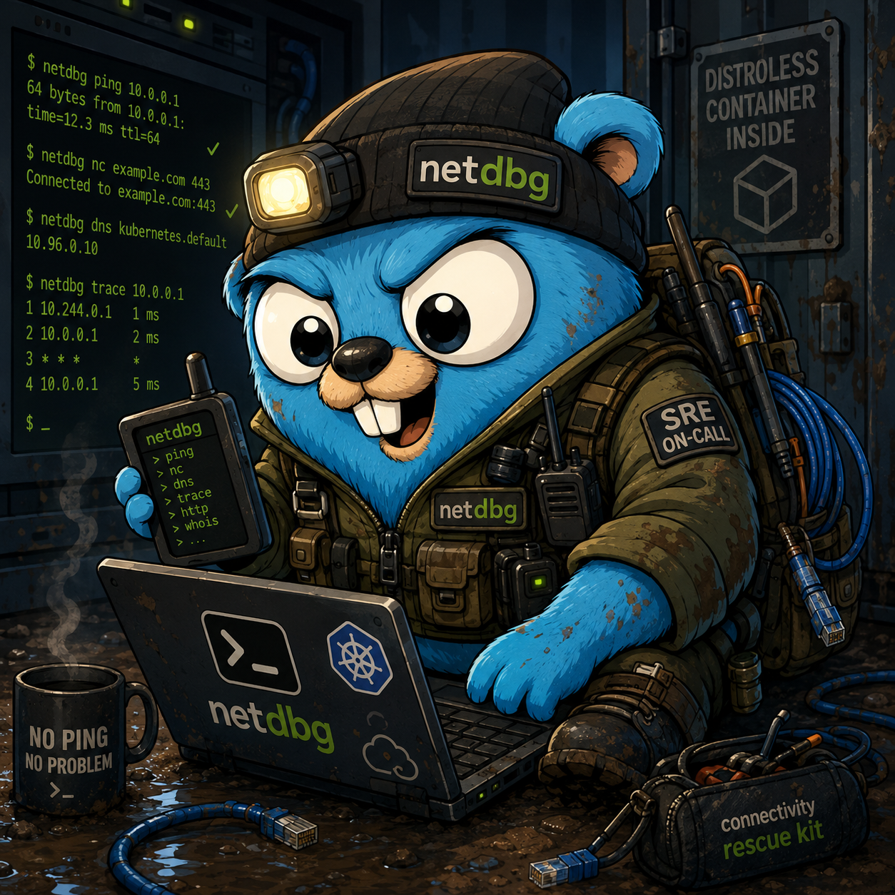

<p align="center">
    
</p>

Netdbg is a powerful command-line tool designed to troubleshoot connectivity issues in environments where common networking utilities such as ping, curl, netcat, dig, nslookup and many others are not available. It brings all the essential network debugging tools together in a single lightweight binary.

## Why?

Imagine a distroless container running inside a Kubernetes cluster. How do you diagnose connectivity problems when the container image only includes the binaries required to run your application? Maybe your application cannot reach another pod... Maybe you do not know the cluster subnet configuration... Maybe a firewall or network policy is blocking traffic... Maybe the proxy endpoint is misconfigured... In these situations, netdbg gives you the tools you need to investigate the problem directly from inside the running environment.

Netdbg is built for troubleshooting real-world networking problems in restricted, minimal, and production-like environments.


## How to?

```sh
# generate binaries on ./bin path
make build

# netcat
netdbg nc -a google.com -p 443
netdbg nc -z -a google.com -p 443
netdbg nc --listen -a 0.0.0.0 -p 5000

# revdns
netdbg revdns -a 192.0.2.1
netdbg revdns -f ips.txt -t 10
netdbg revdns -a 192.0.2.1 -r 8.8.8.8 -P udp -p 53

# kexec
netdbg kexec -n my-namespace -p my-pod --mode download --version v1.2.3 -- nc -a google.com -p 443
netdbg kexec -n myns -p mypod --mode build --goos linux --goarch amd64 -- nc -a 10.0.0.1 -p 80
netdbg kexec -n foo-ns -p bar-pod --mode build --dry-run -- nc -a google.com -p 443
```
